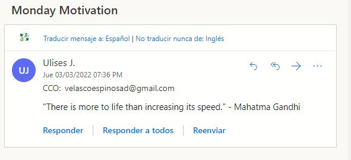
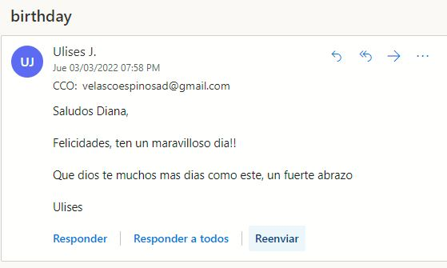

## Email motivacional

Este programa toma una frase del archivo quotes.txt al azar y lo envia por correo a la persona deseada. Puedes configurar el numero del día en que deseas que se mande

---

## Felicitaciones

En este segundo programa se cuenta con una lista de amigos con sus respectivos datos a los que se desea enviar felicitación, tambien se cuenta con plantillas predeterminadas de felicitación. Sí se ejecuta el programa en la fecha de cumpleaños de un amigo el programa tomará una plantilla y la adaptara con el nombre de ese amigo, para finalmente enviarsela como felicitación por correo. 

Como se muestra a continuación

